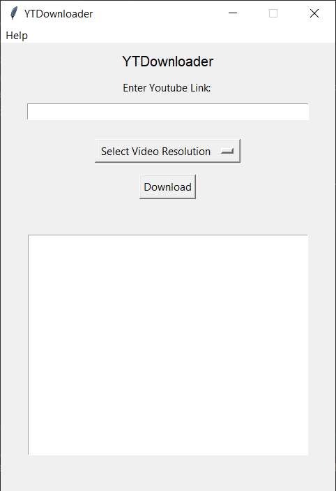

<h1>YTDownloader</h1>

YTDownloader is for download videos from YouTube easily.

<h2>How to run it?</h2>

Just run main.py file.

<h2>Requirements</h2>

<ul>
    <li>Python 3.9 or higher</li>
    <li>Tkinter library</li>
</ul>

<h2>Screenshot from v0.1<h2>
